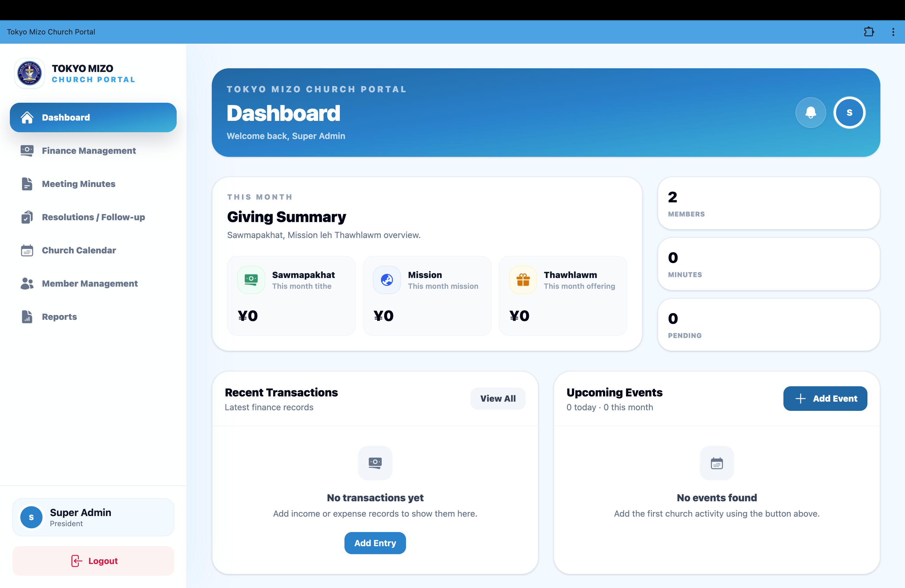

# Tokyo Mizo Church Portal

Tokyo Mizo Church Portal is a modern church management system built with Ruby on Rails 8. It helps church leaders manage members, finances, meeting minutes, announcements, events, and notifications from a single platform.

## Live Demo

Demo site: https://tokyo-mizo-church-portal.onrender.com

| Email | Password | Access |
| --- | --- | --- |
| demo@tokyomizochurch.org | Demo@2026 | Limited demo account |

## Features

* Member Management
* Finance Management (Income, Expenses, Reports)
* Meeting Minutes & Resolution Tracking
* Church Announcements
* Event Management
* Notifications System
* Role-Based Access Control
* PDF & Excel Report Export
* Mobile-Friendly Responsive Design

## User Roles

* Super Admin
* Pastor
* Adviser
* Secretary
* Treasurer
* Member

## Technology Stack

* Ruby on Rails 8
* PostgreSQL
* Hotwire (Turbo & Stimulus)
* Tailwind CSS
* Devise Authentication
* Prawn PDF
* Axlsx Excel Export

## Purpose

The portal is designed to improve church administration, record keeping, communication, and financial transparency while providing a secure and user-friendly experience for church leaders and members.

Developed for Tokyo Mizo Church, Japan.
